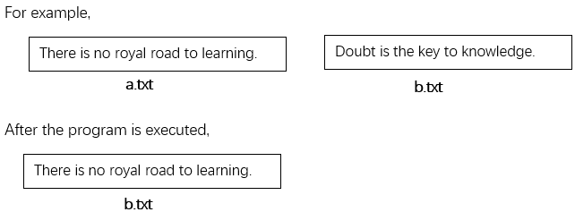

# Task No. L13T1

## Task Requirements
Write a function `int fileCopy(char *destFileName, char *resFileName)` to replace the content of the file `destFileName` with that of the file `resFileName`. If the file is copied successfully, return `1`, else return `0`. The `main` function is as follows. If succeed, check the file content in `fileName2`. 

```c
int main()
{
    char fileName1[20], fileName2[20];
    int flag;
    strcpy(fileName1, "a.txt");
    strcpy(fileName2, "b.txt");
    flag = fileCopy(fileName2, fileName1);
    if (flag == 1) 
        printf("Success"); 
    else 
        printf ("Failure");
    return 0;
}
```

## Non-Functional Requirements

Prepare `a.txt` file with some contents, then copy the contents in `a.txt` to `b.txt` 

## I/O samples


