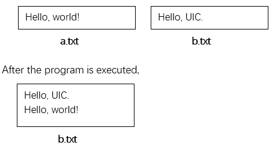

# Task No. L13T2

## Task Requirements
Write a function `int fileCombine(char *destFileName, char *resFileName)` to add the content from the file `resFileName` to the end of the file `destFileName`. If the files are combined successfully, return `1`, else return `0`. The `main` function is as follows. If succeed, check the file content in `fileName2`. 

```c
int main()
{
    char fileName1[20], fileName2[20];
    int flag;
    strcpy(fileName1, "a.txt");
    strcpy(fileName2, "b.txt");
    flag = fileCombine(fileName2, fileName1);
    if (flag == 1) 
        printf("Success");
    else 
        printf ("Failure");
    return 0;
}
```

## Non-Functional Requirements

Prepare `a.txt` file and `b.txt` file with some contents, then add the contents in `a.txt` to the end of `b.txt`

## I/O samples

