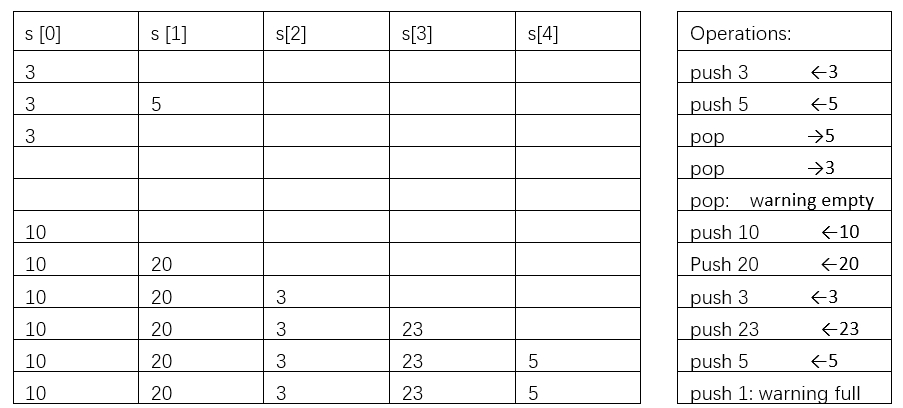

# # Task No. L7T1

## Task Requirements
Write a program that uses array to implement a stack. At the beginning, the stack (array) is empty. There are two operations on the stack: push and pop. 
1.	The push operation is to add an element into an array, subsequent to the last element. If the array is full, i.e., the total number of elements in the array is the size of array, give the warning to “unsuccessful push operation”.
2.	The pop operation is to remove the last element from the array. If the array is empty, give the warning to “unsuccessful pop operation”.
Following table shows an example. Assume that size of array is 5.



After each operation, the system should print out the element currently in the array in sequence. Please refer to the samples. You can use 1 to indicate the push operation, 2 to indicate pop operation and 0 to terminate the execution.

## Non-Functional Requirements

Use a macro to define the size of the array. 

## I/O samples
```
Please choose action(1: Push 2: Pop  0: Exit): 1
Enter an integer to push: 3
----------------------
| Stack: 3 
----------------------
Please choose action(1: Push 2: Pop  0: Exit): 1
Enter an integer to push: 5
----------------------
| Stack: 3 5 
----------------------
Please choose action(1: Push 2: Pop  0: Exit): 2
Popped: 5
----------------------
| Stack: 3 
----------------------
Please choose action(1: Push 2: Pop  0: Exit): 2
Popped: 3
----------------------
| Stack: 
----------------------
Please choose action(1: Push 2: Pop  0: Exit): 2
Unsuccessful pop operation: Stack is empty
----------------------
| Stack: 
----------------------
Please choose action(1: Push 2: Pop  0: Exit): 1
Enter an integer to push: 10
----------------------
| Stack: 10 
----------------------
Please choose action(1: Push 2: Pop  0: Exit): 1
Enter an integer to push: 20
----------------------
| Stack: 10 20 
----------------------
Please choose action(1: Push 2: Pop  0: Exit): 1
Enter an integer to push: 3
----------------------
| Stack: 10 20 3 
----------------------
Please choose action(1: Push 2: Pop  0: Exit): 1
Enter an integer to push: 23
----------------------
| Stack: 10 20 3 23 
----------------------
Please choose action(1: Push 2: Pop  0: Exit): 1
Enter an integer to push: 5
----------------------
| Stack: 10 20 3 23 5 
----------------------
Please choose action(1: Push 2: Pop  0: Exit): 1
Unsuccessful push operation: Stack is full
----------------------
| Stack: 10 20 3 23 5 
----------------------
Please choose action(1: Push 2: Pop  0: Exit): 0
Exiting the program
Press any key to continue...
```
