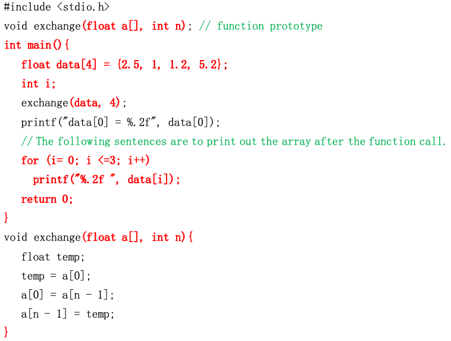

# *#$ Task No. L8T3

## Task Requirements
The exchange function in the following program was originally designed for the exchange of the first and the last data in an array. Please change this function such that it will find and return the biggest value in the array `data`. The main function will print out the returned value.
The code in **red** color **cannot be changed**. The data and their sequence in the array should keep unchanged when biggest element is searched for.




## Non-Functional Requirements

None

## I/O samples

Sample
```
The biggest element in the array is 5.20
2.50 1.00 1.20 5.20
Press any key to continue...
```
